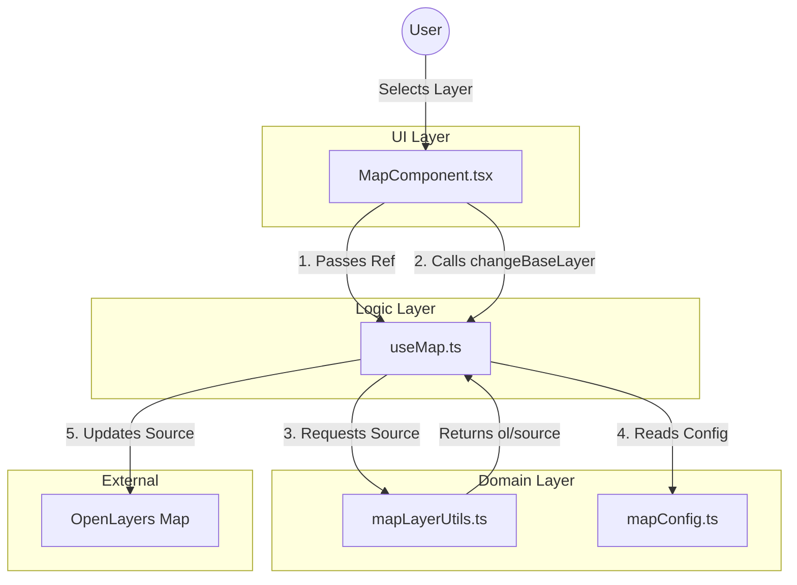

# Application Architecture & Component Flow

This document outlines the architecture and data flow of the Map Application, designed with **Clean Architecture** principles to ensure separation of concerns and loose coupling.

## Architecture Overview

The application is divided into three main layers:

1.  **UI Layer (`src/components`)**: Responsible for rendering the interface and handling user interactions.
2.  **Logic Layer (`src/hooks`)**: Manages state, side effects, and integrates with external libraries (OpenLayers).
3.  **Domain/Utility Layer (`src/utils`, `src/config`)**: Contains pure functions, configuration, and business logic independent of React.

## Key Components

### 1. `MapComponent.tsx` (UI Layer)
*   **Role**: The View.
*   **Responsibilities**:
    *   Renders the map container (`div`).
    *   Renders UI controls (e.g., Layer Switcher Dropdown).
    *   Passes a `ref` to the hook to bind the map.
    *   Calls methods exposed by `useMap` (e.g., `changeBaseLayer`) based on user input.
*   **Dependencies**: `useMap`.

### 2. `useMap.ts` (Logic Layer)
*   **Role**: The Controller / ViewModel.
*   **Responsibilities**:
    *   Initializes the OpenLayers `Map` instance.
    *   Manages the `baseLayer` and `currentProvider` state.
    *   Exposes actions (`changeBaseLayer`, `setCenter`) and state (`isMapReady`) to the UI.
    *   **Crucial**: It acts as the bridge between the UI and the OpenLayers logic, keeping the UI "dumb".
*   **Dependencies**: `mapLayerUtils`, `mapConfig`.

### 3. `mapLayerUtils.ts` (Domain Layer)
*   **Role**: Business Logic / Factory.
*   **Responsibilities**:
    *   Contains the `createBaseLayerSource` factory function.
    *   Holds the specific configuration for each map provider (URLs, attributions).
    *   Ensures that adding a new map provider only requires changes in this file.

### 4. `mapConfig.ts` (Configuration)
*   **Role**: Constants.
*   **Responsibilities**: Defines static configuration like default center, zoom levels, etc.

## Data Flow

### 1. Map Initialization
1.  `MapComponent` mounts and creates a `ref`.
2.  `useMap` is called with this `ref`.
3.  `useMap` calls `createBaseLayerSource('OSM')` (default) from `mapLayerUtils` to get the initial source.
4.  `useMap` initializes the OpenLayers `Map` and attaches it to the `ref`.
5.  `isMapReady` state is set to `true`, notifying `MapComponent`.

### 2. Layer Switching (Loose Coupling Example)
1.  User selects a new layer (e.g., "Google Hybrid") in `MapComponent`.
2.  `MapComponent` calls `changeBaseLayer('GOOGLE_HYBRID')` from `useMap`.
3.  `useMap` calls `createBaseLayerSource('GOOGLE_HYBRID')` from `mapLayerUtils`.
4.  `mapLayerUtils` returns the specific `ol/source` configured for Google Hybrid.
5.  `useMap` updates the existing `baseLayer` with the new source (`baseLayer.setSource(newSource)`).
    *   *Note*: The map object is NOT recreated, ensuring performance.

## Interaction Diagram

